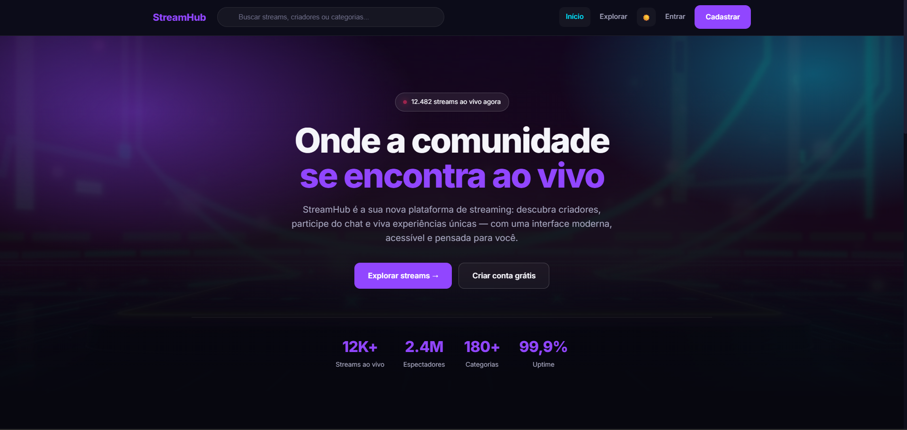

# StreamHub

<div align="center">

### Plataforma de Streaming focada em UX, UI e Interação Humano-Computador

Projeto acadêmico desenvolvido para a disciplina de **Interação Humano-Computador (IHC)** com foco em **Usabilidade, Acessibilidade, Design Thinking e Heurísticas de Nielsen**.



</div>

---

## Sobre o Projeto

O **StreamHub** é uma plataforma de streaming inspirada em serviços como Twitch e Kick, desenvolvida com o objetivo de aplicar, na prática, conceitos fundamentais de **Experiência do Usuário (UX)** e **Interação Humano-Computador (IHC)**.

O projeto foi concebido para oferecer uma experiência moderna, intuitiva e acessível, priorizando a facilidade de navegação, a descoberta de conteúdo e a interação entre usuários e criadores de conteúdo.

Além do desenvolvimento da interface, foram aplicados processos de **Design Thinking**, criação de **Personas**, avaliações baseadas nas **10 Heurísticas de Nielsen** e **Testes de Usabilidade**.

---

## Objetivos

- Aplicar conceitos de UX e IHC em um projeto real.
- Desenvolver uma interface intuitiva e acessível.
- Implementar princípios de Design Thinking.
- Avaliar a interface utilizando as Heurísticas de Nielsen.
- Validar decisões de design através de testes de usabilidade.
- Demonstrar boas práticas de desenvolvimento Front-End.

---

## Protótipo no Figma

<div align="center">

### Prototipação e Design da Interface

Acesse a versão completa do protótipo desenvolvido no Figma.

[](COLE_AQUI_O_LINK_DO_FIGMA)

</div>

O protótipo foi desenvolvido durante a etapa de Design Thinking e serviu como base para a implementação da interface final do StreamHub, permitindo validar fluxos de navegação, componentes visuais e requisitos de usabilidade.

---

## Funcionalidades

### Autenticação

- Cadastro de usuários
- Login com validação
- Controle de sessão
- Logout

### Streaming

- Página inicial com streams em destaque
- Dashboard para exploração de conteúdo
- Categorias organizadas
- Busca em tempo real

### Favoritos

- Adicionar streams aos favoritos
- Remover favoritos
- Persistência utilizando LocalStorage

### Interação

- Chat ao vivo simulado
- Feedback visual através de Toasts
- Microinterações na interface

### Personalização

- Dark Mode (padrão)
- Light Mode
- Persistência de preferência de tema

### Responsividade

- Mobile First
- Layout adaptável para tablets
- Compatível com desktops

---

## Acessibilidades

O projeto foi desenvolvido considerando princípios de acessibilidade digital:

- Skip Link para navegação rápida
- Uso de HTML semântico
- ARIA Labels
- Contraste adequado (WCAG AA)
- Navegação por teclado
- Feedback para leitores de tela
- Suporte a `prefers-reduced-motion`
- Estados de foco visíveis

---

## Conceitos de IHC Aplicados

### Design Thinking

O desenvolvimento seguiu as etapas:

1. Empatia
2. Definição
3. Ideação
4. Prototipação
5. Testes

### Personas

Foram criadas personas representando:

- Espectadores casuais
- Criadores de conteúdo

### Heurísticas de Nielsen

O sistema foi avaliado utilizando as 10 heurísticas de Nielsen, incluindo:

- Visibilidade do estado do sistema
- Consistência e padrões
- Controle e liberdade do usuário
- Prevenção de erros
- Reconhecimento em vez de memorização
- Estética e design minimalista

### Testes de Usabilidade

Foram realizadas avaliações de tarefas críticas como:

- Cadastro de usuários
- Busca por streams
- Interação no chat
- Gerenciamento de favoritos

---

## Tecnologias Utilizadas

### Front-End

- HTML5
- CSS3
- JavaScript ES6+

### Recursos

- LocalStorage
- Flexbox
- CSS Grid
- Variáveis CSS
- Animações CSS
- Design Responsivo

---

## Estrutura do Projeto

```text
StreamHub/
│
├── index.html
├── login.html
├── cadastro.html
├── dashboard.html
├── stream.html
├── perfil.html
│
├── assets/
│   ├── css/
│   │   ├── style.css
│   │   └── responsive.css
│   │
│   ├── js/
│   │   ├── storage.js
│   │   ├── auth.js
│   │   └── main.js
│   │
│   ├── images/
│   └── icons/
```

---

## Telas do Sistema

### Página Inicial

- Hero Section
- Streams em destaque
- Categorias

### Dashboard

- Busca em tempo real
- Filtros por categoria
- Cards de stream

### Stream

- Player
- Chat ao vivo
- Favoritar stream

### Perfil

- Informações do usuário
- Lista de favoritos

> Recomenda-se adicionar capturas de tela nesta seção.

---

## Principais Diferenciais

- Aplicação prática de conceitos de IHC

- Interface moderna inspirada em plataformas reais

- Design Responsivo

- Dark/Light Mode

- Persistência de dados com LocalStorage

- Acessibilidade integrada ao projeto

- Documentação acadêmica completa

---

## Limitações

Por se tratar de um projeto acadêmico focado em Front-End:

- Não possui backend real.
- O chat é simulado.
- Os dados são armazenados localmente via LocalStorage.
- Não existe transmissão de vídeo real.

Essas limitações foram aceitas para manter o foco nos conceitos de UX, UI e IHC.

---

## Autores

- [**Antonio Augusto**](https://github.com/auguxtodev)
- [**Gustavo Brunholi**](https://github.com/gubrunholi)
- [**Henry Silva**](https://github.com/Henrysilva123)
- [**Yuji**](https://github.com/YujiScripts)
- [**Leonardo Silva Oliveira**](https://github.com/LeonardoSilva1-hub)

Projeto desenvolvido para fins acadêmicos na disciplina de **Interação Humano-Computador (IHC)**.

---
